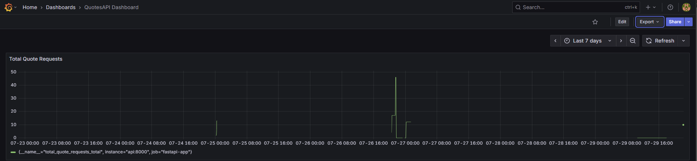
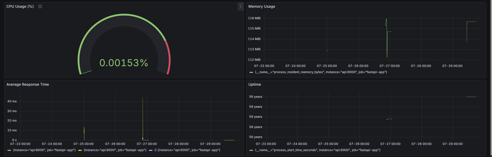

#  Quotes API

A simple Quotes API built with FastAPI

## Features

- Clean FastAPI architecture
- Rate limiting with Redis
- Logging with Python’s `logging` module
- Metrics via Prometheus
- Visualization & Dashboards in Grafana
- Fully Dockerized for Dev Container

---

## Dev Container Setup

### Prerequisites

- [Docker](https://www.docker.com/)
- [Visual Studio Code](https://code.visualstudio.com/)
- [Remote - Containers Extension](https://marketplace.visualstudio.com/items?itemName=ms-vscode-remote.remote-containers)

### Getting Started

1. **Clone the repository**

```bash
git clone https://github.com/mauranpavan/QuotesAPI.git
cd QuotesAPI
```

2. **Open in VS Code**

> Use the `Remote - Containers: Open Folder in Container` command.

3. **Dev Container will automatically:**

- Install dependencies from `requirements.txt`
- Start `uvicorn` FastAPI app
- Start Redis, Prometheus, and Grafana services
- Make your API available at `http://localhost:8000`

---

## API Docs

- Swagger UI: [http://localhost:8000/docs](http://localhost:8000/docs)
- ReDoc: [http://localhost:8000/redoc](http://localhost:8000/redoc)

---

### Example Endpoints

| Endpoint           | Description              |
|-------------------|--------------------------|
| `/quotes/random`  | Get a random quote       |
| `/quotes?author=...` | Filter by author     |
| `/metrics`         | Prometheus metrics       |
| `/docs`            | Swagger UI               |
| `/redoc`           | ReDoc documentation      |

---

## Monitoring & Observability

### Prometheus

- Collects metrics from `/metrics`
- Configured via `prometheus.yml`

### Grafana

- Available at `http://localhost:3000`
- Added Prometheus as data source: `http://localhost:9090/`

#### Dashboards



---
## Dependencies

Installed via `requirements.txt`:

```text
fastapi
uvicorn
pandas
redis
fastapi-limiter
prometheus-client
```

## License

MIT License

---
